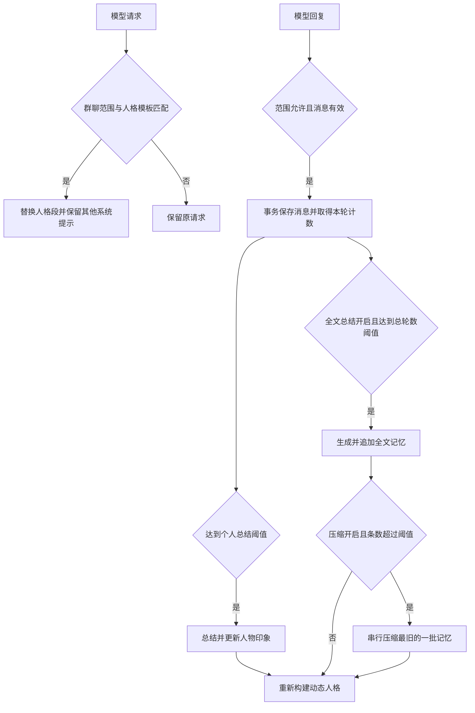

# PersonaFlow（人格关系流）1.1

[](https://github.com/AstrBotDevs/AstrBot)
[](https://github.com/yizyin2/astrbot_plugin_PersonaFlow)

PersonaFlow 为 AstrBot 提供人物印象、全文记忆和自动压缩功能。插件根据用户与机器人的对话生成关系、印象及长期记忆，再将这些内容加入指定人格的提示词，使新会话能够继续使用已保存的记忆。

## 主要功能

- **人物关系与印象**：按每位用户的对话次数触发总结，使用用户 ID 保存，支持跨群沿用。
- **全文总结**：按所有生效会话的累计对话次数生成记忆，每次追加一条 Memory。
- **灵活注入**：支持 `{Impression}` 和 `{Memory}` 占位符；缺少占位符时，对应内容追加到人格末尾。
- **全文总结总开关**：关闭后停止生成和使用全文记忆，保留已有 Memory 数据，人物印象功能继续工作。
- **可配置压缩**：自定义压缩触发条数和每批条数，将最旧的一批记忆合并成一条；压缩结果可以再次参与压缩。
- **保留框架提示**：只替换请求中匹配的原始人格段，保留其他插件、技能和工具提示。
- **人格修改自动生效**：每次请求使用 AstrBot 当前的人格模板组装已有记忆，保存人格后下一条请求即可生效，无需重载插件。
- **并发保护**：消息保存与计数读取使用同一事务；记忆压缩串行执行，并在提交时校验待替换记录。

## 安装与启用

1. 将插件目录放入 AstrBot 的 `data/plugins/astrbot_plugin_PersonaFlow/`，或通过插件管理安装本仓库。
2. 重启 AstrBot 或重载插件，并在管理面板启用 PersonaFlow。
3. 将 `personas_name` 设置为 AstrBot 中已有的人格名称，并在目标会话中选用该人格。
4. 按需填写 `apply_to_group_chat`。填写群号后仅在这些群聊中记录和注入；留空时对全部群聊和私聊生效。
5. 修改插件配置后重载插件。日常编辑并保存 AstrBot 的原始人格提示词后，下一条请求会自动使用新模板，不需要重载插件。

群聊筛选使用群号，支持 AstrBot 的独立会话模式。不同生效会话共享同一个插件数据库，全文总结会汇总这些会话的记录。

## 配置说明

下表为插件默认值，已有安装以管理面板中保存的配置为准。

| 配置项 | 类型 | 默认值 | 说明 |
| --- | --- | --- | --- |
| `personas_name` | String | `""` | 需要使用记忆的已有 AstrBot 人格名称。 |
| `summary_trigger_threshold` | Int | `5` | 每位用户累计多少轮有效对话后触发人物印象总结。 |
| `summary_history_count` | Int | `20` | 人物印象总结读取该用户最近多少条对话记录。 |
| `apply_to_group_chat` | List | `[]` | 生效群号列表；为空时允许全部群聊和私聊。 |
| `database_path` | String | `null` | 留空时使用 `data/plugin_data/astrbot_plugin_PersonaFlow/OSNpermemory.db`。 |
| `summary_max_retries` | Int | `3` | 模型总结的最大尝试次数，包含首次调用。 |
| `enable_memory_summary` | Bool | `true` | 全文总结总开关，同时控制生成、注入及向人物印象总结提供全文记忆。 |
| `summary_memory_trigger_threshold` | Int | `20` | 所有生效会话累计多少轮有效对话后触发一次全文总结。 |
| `summary_memory_history_count` | Int | `30` | 全文总结读取所有用户最近多少条对话记录。 |
| `enable_memory_compaction` | Bool | `true` | 是否在新增全文总结后检查并执行自动压缩。 |
| `memory_compaction_threshold` | Int | `30` | Memory **超过**此条数时触发压缩，等于时不压缩；至少为 2。 |
| `memory_compaction_batch_size` | Int | `20` | 每次将最旧的多少条记忆合并成一条；至少为 2，且不超过压缩阈值。 |

压缩参数无法转换为整数或小于 2 时，会回退为各自默认值；批量大于阈值时按阈值执行。全文总结的“对话轮数”和压缩的“Memory 条数”是两种不同的计数。

例如，以下配置表示每 50 轮有效对话生成一次全文总结，超过 30 条 Memory 后，每次压缩最旧的 20 条：

```json
{
  "enable_memory_summary": true,
  "summary_memory_trigger_threshold": 50,
  "summary_memory_history_count": 50,
  "enable_memory_compaction": true,
  "memory_compaction_threshold": 30,
  "memory_compaction_batch_size": 20
}
```

## 人格提示词与占位符

可在原始人格中指定记忆的插入位置：

```text
你是一个叫“小周周”的 AI 助手，性格活泼可爱。

你认识的人：
{Impression}

以前的聊天记忆：
{Memory}

请根据这些关系和记忆，用符合人设的语气回答。
```

- `{Impression}`：替换为全部已保存的人物关系与印象；没写时追加到人格末尾。
- `{Memory}`：全文总结开启时替换为全部已保存的 Memory；没写时，将已有记忆追加到人格末尾的“历史对话记忆”段落。
- 没有 Memory 且没写 `{Memory}` 时，不追加空段落；显式占位符在暂无记忆时显示“暂无记忆总结。”。
- 全文总结关闭时，清空动态提示词中的 `{Memory}`，不再追加记忆，也不再将 Memory 提供给人物印象总结。已有数据保留，重新开启并重载插件后可恢复使用。

插件每次从原始人格模板重新构建动态版本，不会反复堆叠追加段落。注入时保留框架的其他系统提示；如果非空请求中找不到匹配的人格模板，会跳过替换。因此请让会话使用 `personas_name` 对应的人格。

保存原始人格修改后，后续聊天请求及总结任务都会从 AstrBot 当前的内存模板重新组装提示词，保留已保存的人物印象和 Memory。这个刷新过程不调用模型，只有内容变化时才更新插件数据库。已发出的请求和已有会话历史不会被重写。

如果人格在请求组装过程中发生修改，本次保留原请求，下一条请求使用新模板。同一请求已注入的人格段仍然存在时，重复执行注入不会追加第二份记忆；中途新增的记忆从下一条请求开始使用。

## Memory 自动压缩

1. 一次全文总结成功生成并进入保存流程后，检查自动压缩开关及 Memory 条数。
2. 超过 `memory_compaction_threshold` 时，读取最旧的 `memory_compaction_batch_size` 条记录。
3. 调用当前会话的模型，将这一批记录合并成一条总结。
4. 模型返回有效非空内容后，在事务中替换原记录。并发任务串行执行，过期批次不会再次写入；压缩失败时保留原记录。

默认的 `30 / 20` 配置下，**31 条记忆会变成 12 条**：一条压缩总结和最新的 11 条原始记忆。每次触发只处理一批；插件启动时不会单独执行压缩。将两个参数都设为 `10` 可恢复原来的固定条数行为。

压缩结果获得新 ID，但继承被压缩批次中最旧记录的时间。读取时按时间、ID 排序，因此通常保留在旧时间位置；相同时间戳的记录仍会按 ID 排序。压缩结果仍是普通 Memory，可以再次压缩。

压缩限制的是记录数量，不是字数或 Token 数。模型压缩会概括内容，多次压缩可能逐渐省略细节。

## 命令

| 命令 | 作用 |
| --- | --- |
| `/osn check` | 查看全部已保存的人物印象、关系和对话次数。 |
| `/osn checkmem` | 查看全部 Memory 内容及记录时间。 |
| `/osn del <用户ID>` | 删除该用户在 Impression、Message 表中的记录，并尝试刷新动态人格。 |

`/osn del` 不会清理 Memory 总结中已经包含的该用户信息，也不会删除 AstrBot 自身的会话历史。`/new` 或 `/reset` 可以重置会话上下文，但不会清空插件的 Memory。

以上三个命令仅允许 **AstrBot 管理员**使用，群聊和私聊均会校验。管理员身份使用 AstrBot 的 `event.is_admin()` 判定，请在 AstrBot 配置的管理员 ID 列表（`admins_id`）中添加账号；仅有群主或群管理员身份不会自动获得权限。普通用户调用时会收到权限不足提示，指令不会读取或删除数据库内容。

命令不受 `apply_to_group_chat` 的记录与注入范围限制，管理员可以在群聊或私聊中执行。

## 数据与处理流程

插件使用独立 SQLite 数据库，并启用 WAL 模式。只有表结构初始化完成后，连接才会提供给其他协程。

| 数据表 | 内容 |
| --- | --- |
| `Impression` | 用户名称、关系、印象及对话计数。 |
| `Message` | 合并后的用户消息与模型回复。 |
| `Memory` | 全文总结和压缩总结。 |
| `dynamic_personas` | 插件生成的动态人格提示词及相关模板字段。 |

原始人格从 AstrBot 内存读取，动态人格保存在插件数据库中。插件不会修改 AstrBot 的原始人格模板。



## 版本历史

### 1.1

- 全文总结总开关统一控制生成和使用记忆；缺少 `{Memory}` 时自动追加到人格末尾。
- 开放 `memory_compaction_threshold` 和 `memory_compaction_batch_size`，默认值分别为 30、20，并校验有效范围。
- 人格注入保留框架、技能和工具提示，避免覆盖整段系统提示词。
- 保存人格模板后，下一条请求自动刷新动态人格；聊天、印象总结、全文总结和压缩共用最新模板，无需反复重载插件。
- 消息保存、个人计数及总计数读取放入同一事务，修复并发下重复或漏触发总结。
- 记忆压缩串行执行并校验待替换批次，避免重复写入。
- 群号白名单兼容独立会话模式。
- 查看人物印象、查看全文记忆及删除用户记录的指令增加 AstrBot 管理员校验，普通用户无法查询或删除数据。
- 数据库初始化成功后才公开连接，初始化失败或取消时清理连接；卸载时先停止启动同步任务。
- 更新配置说明、命令行为说明和代码注释。

### 1.0.0

- 添加 Memory 表和独立的全文总结流程。
- 启动时同步人格模板，跳过模型错误响应的消息存储。

### 0.7 / 0.77

- 增加人物印象查询、删除命令，规范插件数据路径和聊天记录格式。
- 移除早期缓存机制。

### 0.6 及更早版本

- 引入 aiosqlite、WAL 和动态人格存储，改进总结重试及 JSON 解析。

## 作者与许可证

- 作者：yizyin
- 插件仓库：[yizyin2/astrbot_plugin_PersonaFlow](https://github.com/yizyin2/astrbot_plugin_PersonaFlow)
- 许可证：GNU AGPL v3，详见 [LICENSE](LICENSE)。
